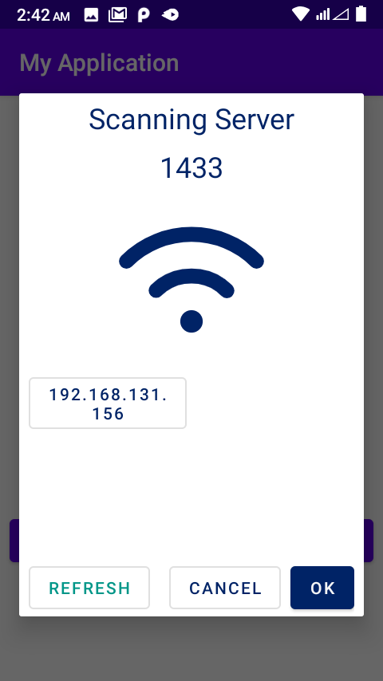
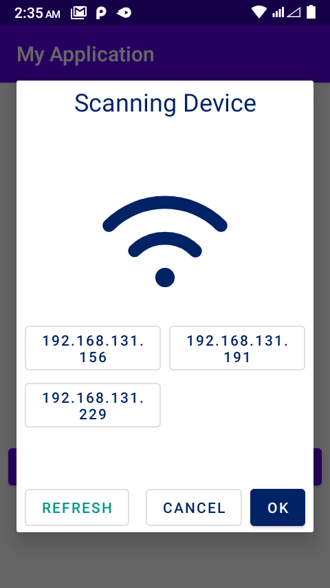

*****ShowDevice IP in a Wi-Fi Network && Show PortAvailable IP***** <br/>
======================
**build.gradle(app)**


```groovy
dependencies {
//..........
    implementation 'com.github.lavahasif:PortScan_Android:2'
Or

implementation 'com.github.lavahasif:PortScan_Android:1.0.11'
// -----------
}

```
**------------------IF gradle greater than 7------------------------**
<br/>
**settings.gradle**


```groovy
import org.gradle.api.initialization.resolve.RepositoriesMode

dependencyResolutionManagement {

    repositories {
        google()
//    notice here -------------------------
        repositoriesMode.set(RepositoriesMode.PREFER_SETTINGS)
  
        mavenCentral()
        maven { url 'https://jitpack.io' }
        jcenter() // Warning: this repository is going to shut down soon
              //    notice here -------------------------
    }
}
rootProject.name = "My Application"
include ':app'


```

**build.gradle**


```groovy
allprojects {
    repositories {
        google()
        mavenCentral()
        maven { url "https://jitpack.io" }
    }
}
```
**------------------IF gradle greater than 7------------------------**
<br/>
**Add Manifest**

```xml

<uses-permission android:name="android.permission.INTERNET" />
```


<h4>For showing port enabled Ip</h4>
***Using In Kotlin***

```kotlin
 fun ShowIp() {
    val timeout_port = 1500
    val timeout_ip = 1500
    var type = 2;
    var ip = "";
    var port = "3389";//empty means automatically select port 1433
    val newFragment: NoticeDialogFragment =
        NoticeDialogFragment(
            timeout_ip,
            timeout_port,
            type,
            ip,
            port,
            object : NoticeDialogFragment.NoticeDialogListener {
                override fun onDialogPositiveClick(dialog: DialogFragment?, ip: String) {
                   // textviewStatus.text = ip;
                    dialog?.dismiss()

                }

                override fun onDialogNegativeClick(dialog: DialogFragment?) {
                    dialog?.dismiss()

                }

                override fun onIpClicked(ip: String, dialog: DialogFragment?) {
                 //   textviewStatus.text = ip;
                    dialog?.dismiss()
                }

            })
    newFragment.isCancelable = false
    val fr = supportFragmentManager
    newFragment.show(fr, "missiles")


}
```



<h4>showing devices</h4>

```kotlin
 fun showPort() {
    val timeout_port = 1500
    val timeout_ip = 1500
    var type = 1;
    var ip = ""; //empty means automatically select wifi or hotspost ip
    var port = "3389"; //empty means automatically select port 1433
    val newFragment: NoticeDialogFragment =
        NoticeDialogFragment(
            timeout_ip,
            timeout_port,
            type,
            ip,
            port,
            object : NoticeDialogFragment.NoticeDialogListener {
                override fun onDialogPositiveClick(dialog: DialogFragment?, ip: String) {
                 //   textviewStatus.text = ip;
                    dialog?.dismiss()

                }

                override fun onDialogNegativeClick(dialog: DialogFragment?) {
                    dialog?.dismiss()

                }

                override fun onIpClicked(ip: String, dialog: DialogFragment?) {
                   // textviewStatus.text = ip;
                    dialog?.dismiss()
                }

            })
    newFragment.isCancelable = false
    val fr = supportFragmentManager
    newFragment.show(fr, "missiles")


}
```
**Using Java**
```java
    private void showDevice(int i) {
        int timeout_port = 3000;
        int timeout_ip = 3000;
        //type 1 -for show all device
        //     2 -for show port available device
        int type = i; 
        String ip = "";
        String port = "1433";//empty means automatically select port 1433
        NoticeDialogFragment newFragment =
                new NoticeDialogFragment(
                        timeout_ip,
                        timeout_port,
                        type,
                        ip,
                        port,
                        new NoticeDialogFragment.NoticeDialogListener() {
                            @Override
                            public void onIpClicked(@NonNull String s, @Nullable DialogFragment dialogFragment) {
                                IP.setText(s);
                                assert dialogFragment != null;
                                dialogFragment.dismiss();
                            }

                            @Override
                            public void onDialogPositiveClick(@Nullable DialogFragment dialogFragment, @NonNull String s) {
                                IP.setText(s);
                                assert dialogFragment != null;
                                dialogFragment.dismiss();
                            }

                            @Override
                            public void onDialogNegativeClick(@Nullable DialogFragment dialogFragment) {

                                assert dialogFragment != null;
                                dialogFragment.dismiss();
                            }
                        }
                );
        newFragment.setCancelable(false);
        FragmentManager fr = getSupportFragmentManager();
        newFragment.show(fr, "missiles");


    }
```



