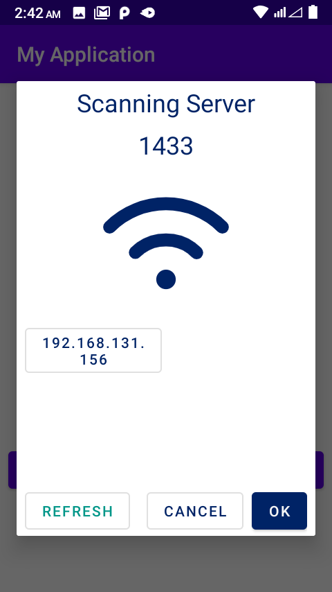
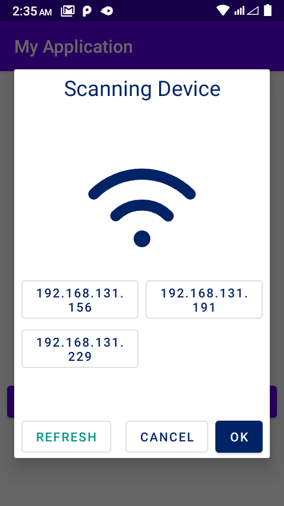

Add Manifest

```xml

<uses-permission android:name="android.permission.INTERNET" />
```

For showing port enabled Ip

```kotlin
 fun confirmFireMissilesPort() {
    val timeout_port = 1500
    val timeout_ip = 1500
    var type = 2;
    var ip = "";
    var port = "3389";//empty means automatically select port 1433
    val newFragment: NoticeDialogFragment =
        NoticeDialogFragment(
            timeout_ip,
            timeout_port,
            type,
            ip,
            port,
            object : NoticeDialogFragment.NoticeDialogListener {
                override fun onDialogPositiveClick(dialog: DialogFragment?, ip: String) {
                    textviewStatus.text = ip;
                    dialog?.dismiss()

                }

                override fun onDialogNegativeClick(dialog: DialogFragment?) {
                    dialog?.dismiss()

                }

                override fun onIpClicked(ip: String, dialog: DialogFragment?) {
                    textviewStatus.text = ip;
                    dialog?.dismiss()
                }

            })
    newFragment.isCancelable = false
    val fr = supportFragmentManager
    newFragment.show(fr, "missiles")


}
```

```kotlin
 fun confirmFireMissilesPort() {
    val timeout_port = 1500
    val timeout_ip = 1500
    var type = 1;
    var ip = ""; //empty means automatically select wifi or hotspost ip
    var port = "3389"; //empty means automatically select port 1433
    val newFragment: NoticeDialogFragment =
        NoticeDialogFragment(
            timeout_ip,
            timeout_port,
            type,
            ip,
            port,
            object : NoticeDialogFragment.NoticeDialogListener {
                override fun onDialogPositiveClick(dialog: DialogFragment?, ip: String) {
                    textviewStatus.text = ip;
                    dialog?.dismiss()

                }

                override fun onDialogNegativeClick(dialog: DialogFragment?) {
                    dialog?.dismiss()

                }

                override fun onIpClicked(ip: String, dialog: DialogFragment?) {
                    textviewStatus.text = ip;
                    dialog?.dismiss()
                }

            })
    newFragment.isCancelable = false
    val fr = supportFragmentManager
    newFragment.show(fr, "missiles")


}
```

show Ip

showing devices
